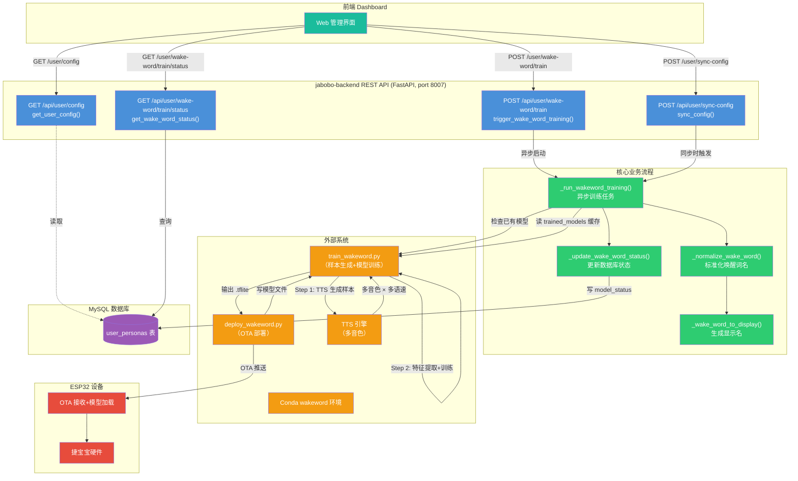
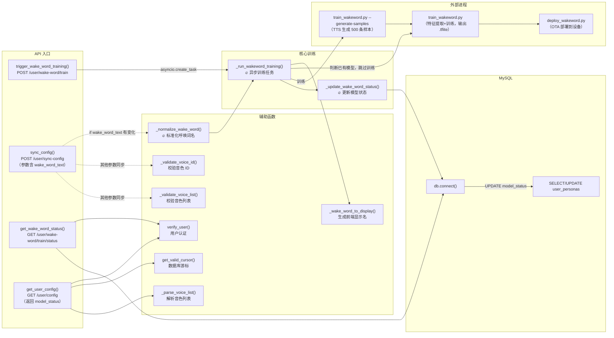
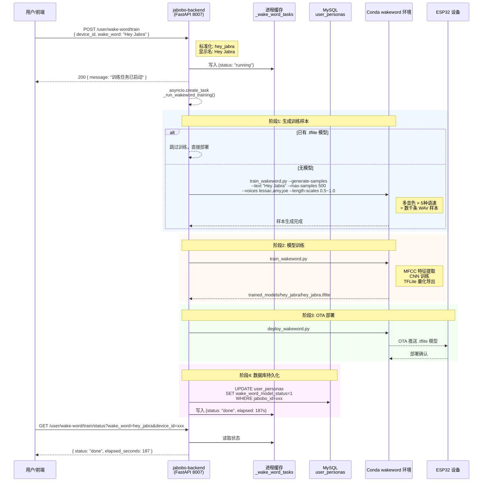
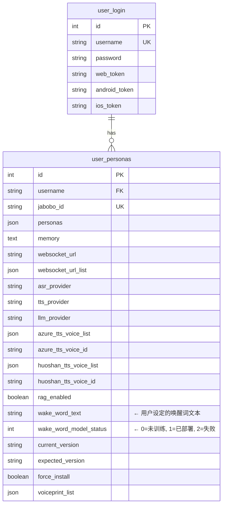
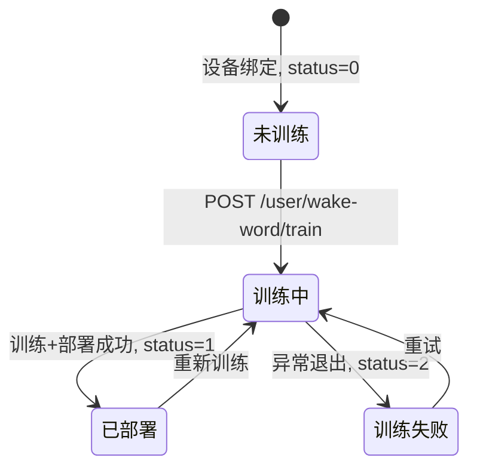

# 唤醒词训练知识图谱

> 由 GitNexus 从 `jabobo-backend` 代码库索引分析生成（274 符号，605 关系）

---

## 📊 整体架构图



---

## 🧩 函数调用关系图



---

## 🕐 完整训练时间线



---

## 🗄️ 数据库表关系



---

## 🔧 配置参数

| 参数 | 值 | 说明 |
|------|-----|------|
| `_TRAIN_WORK_DIR` | `~/Jabobo/wakeword train/` | 训练工作目录 |
| `_TRAIN_CONDA_ENV` | `wakeword` | Conda 训练环境 |
| `_TRAIN_LOG_DIR` | `{WORK_DIR}/_training_logs/` | 每轮训练日志 |
| `max-samples` | `500` | 每轮生成样本数 |
| `length-scales` | `0.5 0.6 0.75 0.9 1.0` | 5 种语速 |
| 英文音色 | `lessac, amy, joe, alan, norman, libritts_r` | 6 种 |
| 中文音色 | `chaowen, huayan, xiao_ya` | 3 种 |

---

## 📝 数据库字段说明

```
user_personas.wake_word_text              — 用户自定义唤醒词（如 "Hey Jabra"）
user_personas.wake_word_model_status      — 0=未训练 1=已部署 2=训练失败
```

**状态机：**



---

> 📍 **总结**: 唤醒词训练模块位于 `app/routes/jabobo_config.py`，由以下 15 个函数协同完成：
> - 4 个 API 入口（`trigger_wake_word_training`, `sync_config`, `get_wake_word_status`, `get_user_config`）
> - 3 个核心业务函数（`_run_wakeword_training`, `_normalize_wake_word`, `_wake_word_to_display`）
> - 1 个数据库状态管理（`_update_wake_word_status`）
> - 7 个辅助函数（认证、语音参数校验等）
>
> 外部依赖：Conda `wakeword` 环境、TTS 引擎、`train_wakeword.py`/`deploy_wakeword.py` 脚本
